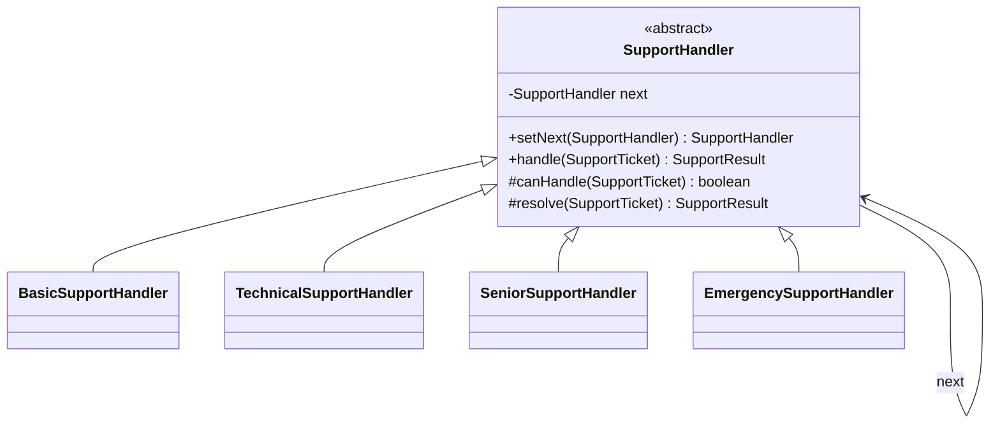
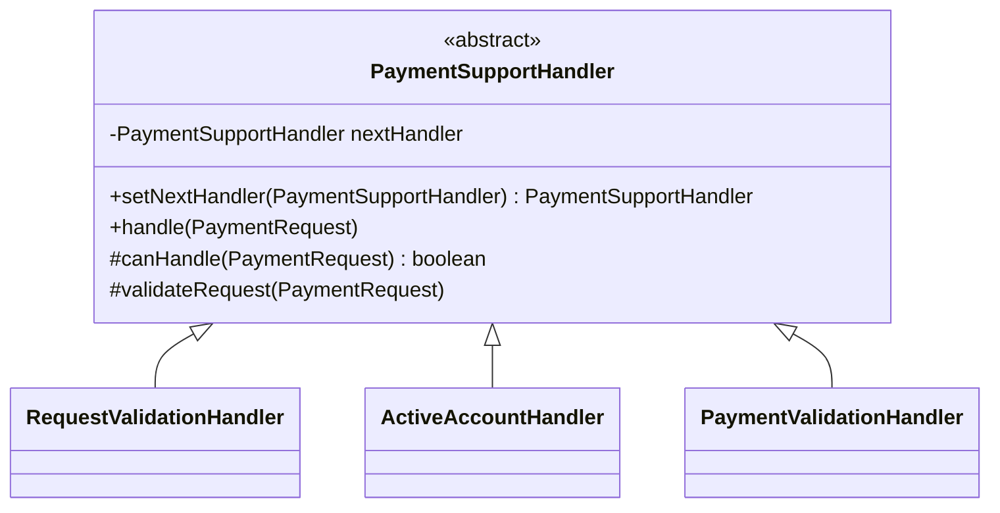

# Chain of Responsibility

`com.prep.pattern_vault.behavioral.chainofresponsibility.*`

## Intent

Avoid coupling a request's sender to a specific receiver by giving more than
one object a chance to handle the request: chain the potential handlers
together, and pass the request along the chain until it's been dealt with.

GoF's own description covers two shapes that both go by this name, and this
repo demonstrates both:

- **First-match dispatch** — each handler either fully handles the request
  and stops the chain, or declines and passes it to the next handler
  untouched. Only one handler ever actually acts. (`singlehandler`)
- **Sequential pipeline** — every handler gets a turn, in order; each does
  its own piece of validation/processing and then always passes the request
  on (like a filter chain / middleware chain, e.g. Java's own Servlet
  `FilterChain`). A handler that finds the request invalid for its check
  aborts the whole chain rather than skipping itself. (`handlerchain`)

## `singlehandler` — first-match support ticket escalation



Each concrete handler owns one severity level (`LOW`, `MEDIUM`, `HIGH`,
`CRITICAL`); `SupportHandler.handle` is the template that ties them together:

```java
public SupportResult handle(SupportTicket ticket){
    if (canHandle(ticket)) return resolve(ticket);
    if (next != null) return next.handle(ticket);
    throw new IllegalArgumentException("No handler found for " + ticket.severity());
}
```

`SupportEscalationFactory.constructChain()` wires
`Basic → Technical → Senior → Emergency`. This is the textbook shape: a
`LOW`-severity ticket is fully resolved by `BasicSupportHandler` and never
reaches the rest of the chain.

```java
SupportHandler chain = new SupportEscalationFactory().constructChain();
SupportResult result = chain.handle(new SupportTicket("t-1", "cust-1", Severity.HIGH, "..."));
// resolved by SeniorSupportHandler; Basic and Technical declined and passed it on
```

## `handlerchain` — sequential payment validation pipeline



`PaymentPipelineFactory.constructChain()` wires
`RequestValidation → ActiveAccount → PaymentValidation`. Unlike
`singlehandler`, every stage is meant to run — `RequestValidationHandler`
checks the request isn't null, `ActiveAccountHandler` checks the account is
active, `PaymentValidationHandler` checks the amount and account number —
and a failure at *any* stage aborts the whole payment rather than letting a
later stage take over:

```java
public void handle(PaymentRequest request){
    if (canHandle(request)) {
        validateRequest(request);
    } else {
        throw new IllegalArgumentException("Invalid request");
    }
    if (nextHandler != null) nextHandler.handle(request);
}
```

```java
PaymentSupportHandler chain = new PaymentPipelineFactory().constructChain();
chain.handle(new PaymentRequest(UUID.randomUUID(), "acct-1", 42.0, true));
```

## Notes

- `ActiveAccountHandler.canHandle` checks `request.accountActive()` — a
  dedicated boolean on `PaymentRequest` added specifically so this handler
  can check what its name says it checks. It previously checked
  `request.requestId() != null`, which is really request-shape validation
  (already `RequestValidationHandler`'s job), not an account-active check —
  there was no field on `PaymentRequest` this handler could have used to
  answer its actual question.
- The `singlehandler` chain used to be correctly implemented but never
  assembled anywhere in the codebase — `SupportEscalationFactory` (mirroring
  `PaymentPipelineFactory`) is what makes it actually usable/demonstrable.
- These two variants are genuinely different shapes, not one right and one
  wrong implementation of the same idea — pick first-match dispatch when
  exactly one handler should own a request (ticket routing, exception
  handling by type), and pick a sequential pipeline when every stage must
  contribute (validation, middleware, filters).
