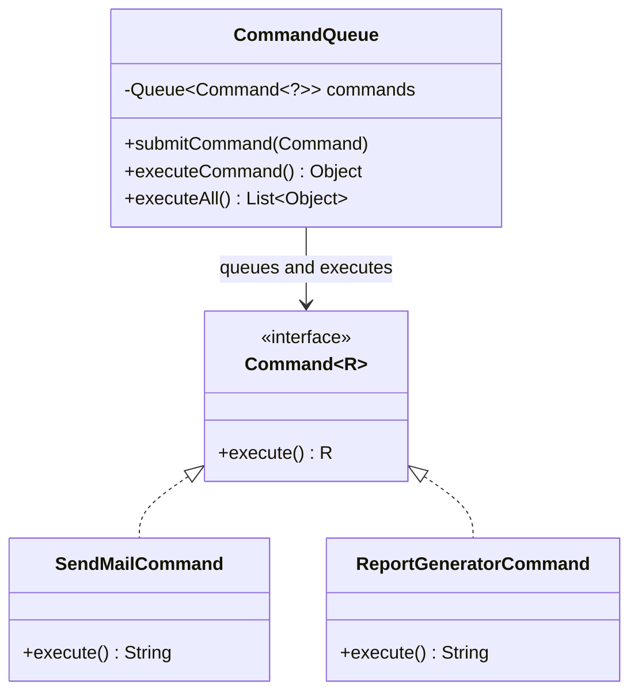
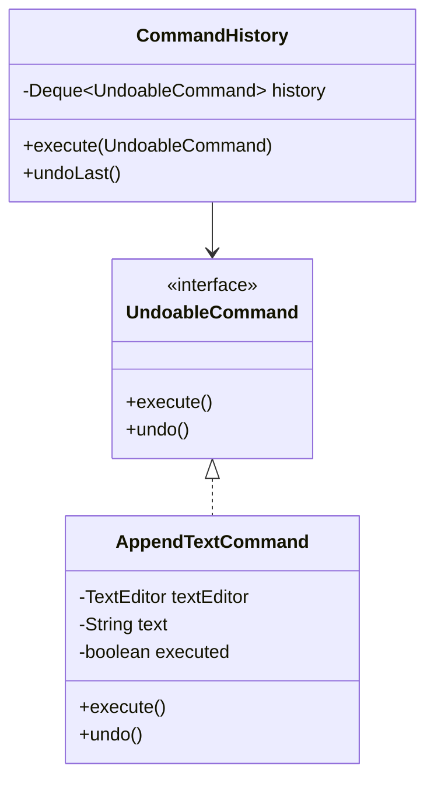

# Command

`com.prep.pattern_vault.behavioral.command.*`

## Intent

Turn a request into a standalone object, so it can be queued, logged, passed
around, or undone — instead of being just a synchronous method call that
disappears the moment it returns. This repo demonstrates two variants: a
command that yields a result (`basicwithreturntype`), and a command that can
be undone (`undoables`).

## `basicwithreturntype` — command with a return value



`Command<R>` is generic in its result type, which is the whole point of this
variant over a plain `void execute()` — the caller gets something back:

```java
public interface Command<R> {
    R execute();
}
```

`CommandQueue` holds a mixed queue of `Command<?>` (different concrete
commands can produce different result types) and both surfaces and
collects those results rather than discarding them:

```java
public Object executeCommand(){
    if (commands.isEmpty()) return null;
    return commands.poll().execute();
}

public List<Object> executeAll(){
    List<Object> results = new ArrayList<>();
    Command<?> command;
    while ((command = commands.poll()) != null) results.add(command.execute());
    return results;
}
```

```java
CommandQueue queue = new CommandQueue();
queue.submitCommand(new SendMailCommand(mailService, request));
queue.submitCommand(new ReportGeneratorCommand(reportGenerator));
List<Object> results = queue.executeAll(); // ["mail sent...", "Report Generation Completed"]
```

## `undoables` — undoable text editing



`CommandHistory` is the invoker: it executes a command and pushes it onto a
stack, and `undoLast()` pops and undoes the most recently executed command
— straightforward LIFO undo:

```java
public void execute(UndoableCommand command) {
    command.execute();
    history.push(command);
}

public void undoLast() {
    if (!history.isEmpty()) history.pop().undo();
}
```

`AppendTextCommand.execute()`/`undo()` guard symmetrically on the same
`executed` flag, so both are safe no-ops when called out of order (undo
before execute, or undo twice):

```java
public void execute() {
    if (!executed && text != null) {
        textEditor.append(this.text);
        this.executed = true;
    }
}

public void undo() {
    if (executed) {
        textEditor.removeLast(text.length());
        this.executed = false;
        this.text = null;
    }
}
```

```java
TextEditor editor = new TextEditor();
CommandHistory history = new CommandHistory();
AppendTextCommand append = new AppendTextCommand(editor);
append.setText("hello");

history.execute(append);   // editor now contains "hello"
history.undoLast();        // editor is back to empty
```

## Notes

- `CommandQueue.executeCommand()` used to guard `if (commands == null)` —
  dead code, since the field is `final` and initialized at declaration, so
  it can never be `null`. The guard needed to be `commands.isEmpty()`,
  otherwise calling `executeCommand()` on an empty queue threw an NPE from
  `commands.poll().execute()` on the `null` returned by `poll()`.
- `undo()` used to have no guard at all, while `execute()` did — calling
  `undoLast()` on a command that was never executed (or already undone)
  called `text.length()` on a `null` `text`, an NPE. Symmetric guards on
  both methods make "undo when there's nothing to undo" a safe no-op
  instead of a crash.
