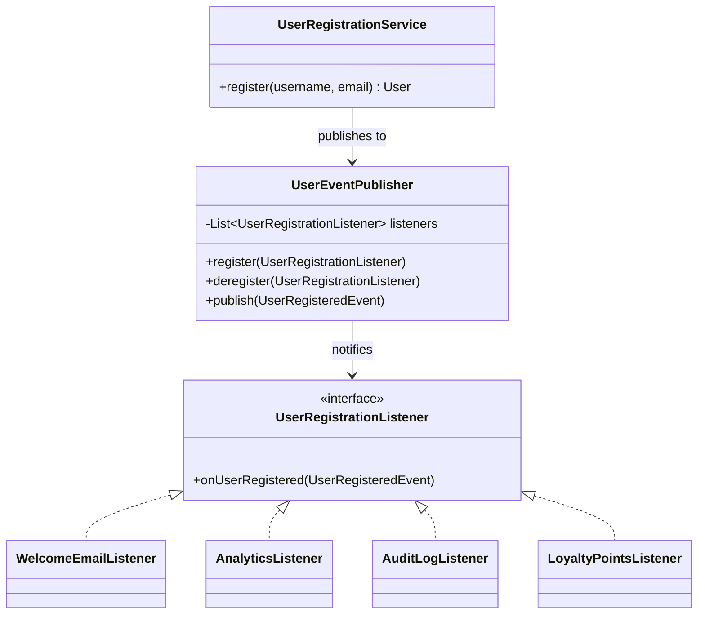

# Observer

`com.prep.pattern_vault.behavioral.observer`

## Intent

Define a one-to-many dependency between objects so that when one object (the
subject) changes state, all of its dependents (observers) are notified
automatically — without the subject knowing anything concrete about who its
observers are, only that they implement a shared listener interface.

## Structure



## This implementation

| Role | Class |
|---|---|
| Subject | `UserEventPublisher` |
| Observer interface | `UserRegistrationListener` |
| Concrete observers | `WelcomeEmailListener`, `AnalyticsListener`, `AuditLogListener`, `LoyaltyPointsListener` |
| Event payload | `UserRegisteredEvent` |
| Publisher-side trigger | `UserRegistrationService` |

`UserEventPublisher` holds a plain list of listeners and calls every one of
them on `publish`:

```java
public void publish(UserRegisteredEvent event){
    for (UserRegistrationListener listener : listeners) {
        listener.onUserRegistered(event);
    }
}
```

`UserRegistrationService.register(...)` is the actual trigger point: it
creates the `User`, then publishes a `UserRegisteredEvent` once registration
is done — it has no idea how many listeners are registered or what any of
them do with the event.

## Usage

```java
UserEventPublisher publisher = new UserEventPublisher();
publisher.register(new WelcomeEmailListener());
publisher.register(new AnalyticsListener());
publisher.register(new AuditLogListener());
publisher.register(new LoyaltyPointsListener());

UserRegistrationService service = new UserRegistrationService(publisher);
service.register("alice", "alice@example.com");
// -> all four listeners fire, in registration order
```

## Notes

- `register`/`deregister` throw if you try to register a listener twice, or
  deregister one that isn't present — a stricter contract than silently
  ignoring the no-op case, which surfaces a wiring mistake immediately
  rather than masking it.
- `publish` has no per-listener exception isolation: if one listener throws,
  the remaining listeners in the list never get notified for that event. A
  production event bus usually wants to catch-and-log per listener so one
  broken subscriber (say, a flaky email service) can't block loyalty points
  or audit logging from firing.
