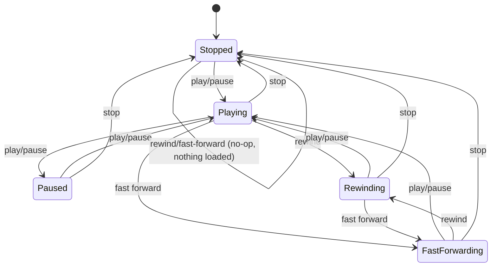
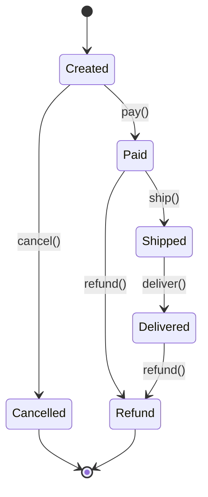

# State

`com.prep.pattern_vault.behavioral.state.*`

## Intent

Let an object change its behavior when its internal state changes, so it
appears to change its class — by extracting each state into its own class
implementing a shared interface, and having the context delegate every
state-dependent call to whichever state object is current, instead of
branching on an enum or a `switch` scattered through the context's methods.

## `musicplayer` — audio player transitions



`AudioPlayer` (the context) holds one `AudioState` and forwards every button
press to it:

```java
public void pressFastForward(){
    audioState.pressFastForwardButton(this);
}
```

Each concrete state (`StoppedAudioState`, `PlayAudioState`, `PausedAudioState`,
`RewindAudioState`, `FastforwardAudioState`) decides, for each of the four
buttons, whether that's a valid transition from itself, and if so calls
`audioPlayer.setAudioState(new ...())` before running the corresponding
action. An invalid or redundant press (rewind while already rewinding, stop
while already stopped) is a no-op with a message, not a crash.

## `order` — e-commerce order lifecycle



Every state extends `OrderState` and overrides `pay`/`ship`/`deliver`/
`cancel`/`refund`; a transition that doesn't make sense from that state
calls the shared `stateException(...)` helper instead of silently doing
something:

```java
protected void stateException(String currentStage, String targetStage){
    throw new IllegalStateException(String.format(
            "Can not transition from %s stage to %s", currentStage, targetStage));
}
```

The refund policy, specifically, is: refundable only once money has changed
hands (`Paid`, before shipping — e.g. the customer cancels a paid order) or
once the order has actually arrived (`Delivered` — a return). It's blocked
from `Created` (nothing was ever paid), `Shipped` (in transit — nothing to
refund against yet, no delivery to trigger a return), and `Cancelled` (a
cancelled order was never paid, so there's nothing to refund).

| Order state | `pay` | `ship` | `deliver` | `cancel` | `refund` |
|---|---|---|---|---|---|
| `Created` | → `Paid` | ✗ | ✗ | → `Cancelled` | ✗ |
| `Paid` | ✗ | → `Shipped` | ✗ | ✗ | → `Refund` |
| `Shipped` | ✗ | ✗ | → `Delivered` | ✗ | ✗ |
| `Delivered` | ✗ | ✗ | ✗ | ✗ | → `Refund` |
| `Cancelled` | ✗ | ✗ | ✗ | ✗ | ✗ |
| `Refund` | ✗ | ✗ | ✗ | ✗ | ✗ |

## Usage

```java
Order order = new Order();
order.pay();     // Created -> Paid
order.ship();    // Paid -> Shipped
order.deliver(); // Shipped -> Delivered
order.refund();  // Delivered -> Refund

order.getCurrentState(); // "REFUNDED"
```

## Notes

- Two `musicplayer` transitions used to be a copy/paste bug: pressing
  fast-forward while rewinding (and vice versa) both landed on
  `PlayAudioState` instead of on the state matching the button actually
  pressed. Pressing rewind/fast-forward from `Stopped` also used to start
  rewinding/fast-forwarding with nothing loaded; both buttons are now a
  no-op there, matching how `pressStop` already behaved in that state.
- The `order` refund policy used to be inverted: refund was allowed on a
  never-paid `Created` order (nothing to refund), `Paid.refund()`
  transitioned to `Cancelled` instead of `Refund` (so a refunded order
  reported itself as merely cancelled), `RefundOrderState.name()` itself
  returned `"CANCELED"` instead of `"REFUNDED"`, and `Delivered.refund()` —
  the one point in the lifecycle where a refund/return is most realistic —
  was blocked outright.
- Both variants keep the context (`AudioPlayer`, `Order`) free of any
  conditional on the current state's identity — every "is this transition
  legal" decision lives inside the concrete state class it applies to,
  which is the actual test of whether a State implementation is doing its
  job: adding a new state should mean adding a new class, not editing an
  existing `switch`.
