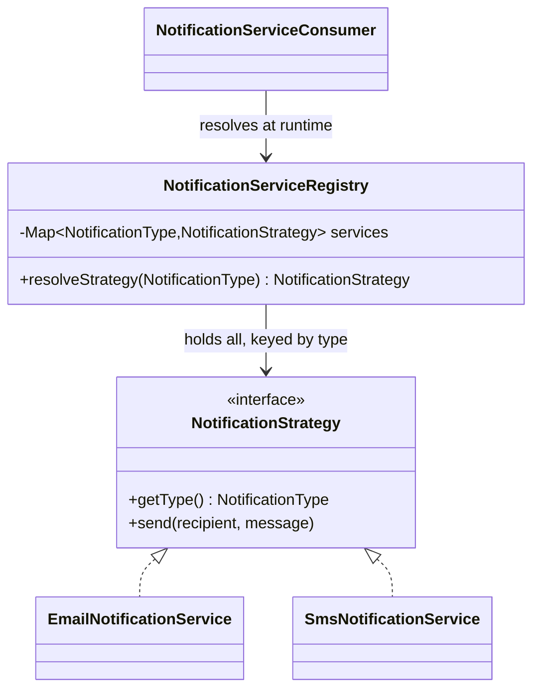

# Strategy

`com.prep.pattern_vault.behavioral.strategy`

## Intent

Define a family of interchangeable algorithms behind a common interface, and
let the client select which one to use at runtime — instead of baking the
choice into an `if`/`switch` that has to be extended every time a new
variant is added.

## Structure



## This implementation

Rather than the client choosing between strategies with an `if`/`switch`,
resolution goes through a registry that Spring populates automatically:

```java
@Component
public class NotificationServiceRegistry {
    private final HashMap<NotificationType, NotificationStrategy> notificationServices = new HashMap<>();

    public NotificationServiceRegistry(List<NotificationStrategy> strategies) {
        for (NotificationStrategy strategy : strategies) notificationServices.put(strategy.getType(), strategy);
    }

    public NotificationStrategy resolveStrategy(NotificationType type){
        if (!notificationServices.containsKey(type)) throw new IllegalArgumentException("Invalid service type");
        return notificationServices.get(type);
    }
}
```

Spring injects *every* bean implementing `NotificationStrategy` as a
`List<NotificationStrategy>` (`EmailNotificationService`,
`SmsNotificationService`, and any future `@Component` implementing the
interface), and the registry indexes them by their own declared
`getType()`. Adding a third channel means writing one new
`@Component implements NotificationStrategy` class — no existing file
changes.

| Role | Class |
|---|---|
| Strategy interface | `NotificationStrategy` |
| Concrete strategies | `EmailNotificationService`, `SmsNotificationService` |
| Strategy resolver | `NotificationServiceRegistry` |
| Client | `NotificationServiceConsumer` |

## Usage

```java
NotificationStrategy strategy = registry.resolveStrategy(NotificationType.EMAIL);
strategy.send("someone@example.com", "your order shipped");
```

`NotificationServiceConsumer.doSomething()` shows the call site, hardcoded
to `NotificationType.EMAIL` for the example — in a real caller, the type
would come from user preference, request context, or similar, and the same
`resolveStrategy` call would pick a different concrete strategy without any
code change.

## Notes

- The registry pattern here is a common, idiomatic way to implement
  Strategy in a Spring codebase — it turns "add a strategy" into "add a
  bean," with the framework doing the collection/wiring that a hand-rolled
  registry would otherwise need a manual registration call for.
