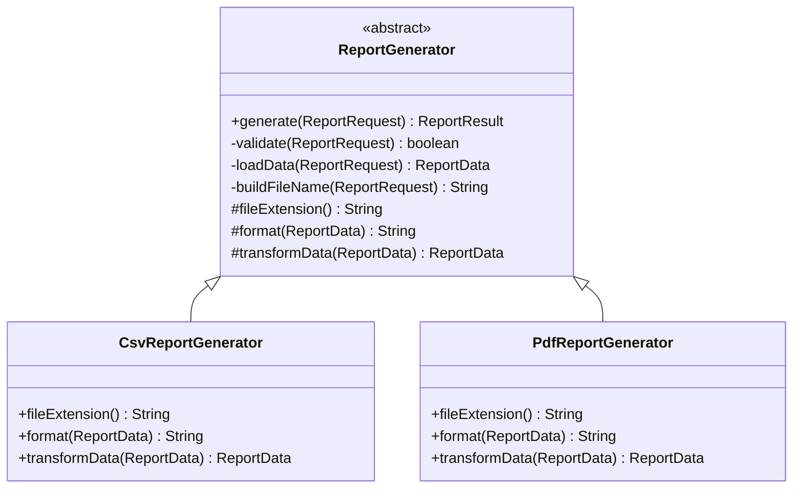

# Template Method

`com.prep.pattern_vault.behavioral.template`

## Intent

Define the skeleton of an algorithm in a base class, deferring only specific
steps to subclasses — so the overall sequence of steps is fixed and can't be
reordered or partially skipped by a subclass, while individual steps remain
customizable.

## Structure



## This implementation

`ReportGenerator.generate(...)` is `final` — the one method a subclass
*cannot* override — which is what makes this genuinely a template method
rather than just an abstract base class: the algorithm's shape is locked in
one place.

```java
public final ReportResult generate(ReportRequest request){
    if (validate(request)){
        var data = loadData(request);
        var transformedData = transformData(data);
        var formattedReport = format(transformedData);
        var fileName = buildFileName(request);
        reportStorage.save(fileName, formattedReport);
        return new ReportResult(request.reportName(), formattedReport, fileName);
    }
    throw new IllegalArgumentException("Couldn't generate report, Invalid request");
}
```

`validate`, `loadData`, and `buildFileName` are shared, non-overridable
private steps; `fileExtension`, `format`, and `transformData` are the
`protected abstract` hook methods each subclass fills in —
`CsvReportGenerator` and `PdfReportGenerator` only ever implement those
three hooks, they never re-implement `generate` itself.

| Role | Class |
|---|---|
| Abstract class (the template) | `ReportGenerator` |
| Concrete subclasses (the hooks) | `CsvReportGenerator`, `PdfReportGenerator` |
| Collaborators | `ReportRepository` (loads data), `ReportStorage` (persists the formatted report) |

## Usage

```java
ReportGenerator csv = new CsvReportGenerator(new ReportStorage(), new ReportRepository());
ReportResult result = csv.generate(new ReportRequest("monthly-orders", fromDate, toDate));
// result.location() -> "/reports/monthly-orders.csv"
```

## Notes

- `validate` used to compare `LocalDate`s with `!=` (reference equality)
  instead of `.equals()` — for boxed/record-held dates that are rarely the
  same object reference, this made the "from and to date must differ" check
  pass almost unconditionally instead of actually comparing the dates.
- `loadData` used to ignore the request entirely and hardcode
  `yesterday..today`, so `request.fromDate()`/`request.toDate()` had no
  effect on which data got loaded — it now forwards the request's own
  range to `repository.load(...)`.
- `buildFileName` concatenates `reportName + fileExtension()` — the hook
  implementations return the extension *with* its leading dot (`".csv"`,
  `".pdf"`), so this method must not add a second one. It previously did
  (`reportName + "." + fileExtension()`), producing filenames like
  `report..pdf`. `CsvReportGenerator.fileExtension()` also used to return
  `.xlsx`, a mismatch with the CSV format it actually produces.
