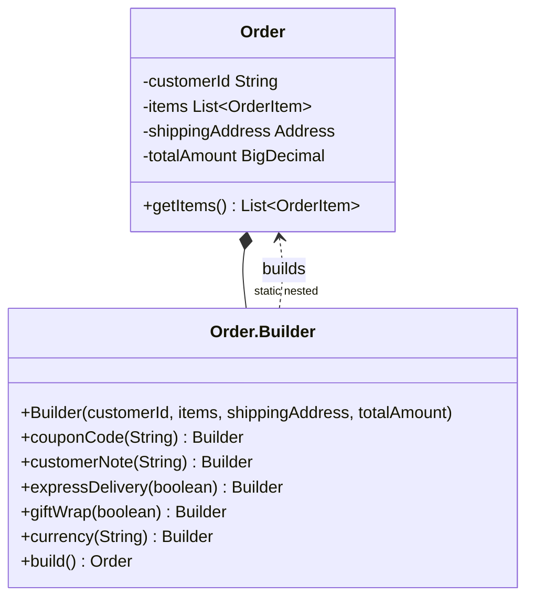

# Builder

`com.prep.pattern_vault.creational.builder`

## Intent

Separate the construction of a complex object (many fields, some required,
some optional, some with defaults) from its representation, so the same
construction process produces a fully-formed, immutable object without a
telescoping constructor or a mutable setter-riddled bean.

## Structure



## This implementation

`Order` follows the classic Joshua Bloch builder from *Effective Java*: the
builder is a `public static final class Builder` nested inside `Order`
itself, `Order`'s own constructor is `private` and only callable from
`Builder.build()`, and every setter on `Builder` returns `this` for
fluent chaining.

```java
Order order = new Order.Builder(customerId, items, shippingAddress, totalAmount)
        .couponCode("SAVE10")
        .giftWrap(true)
        .build();
```

The constructor takes the fields that make no sense to default
(`customerId`, `items`, `shippingAddress`, `totalAmount`); everything else
(`couponCode`, `customerNote`, `expressDelivery`, `giftWrap`, `currency`) is
a fluent setter with a sensible default already assigned on the `Builder`
field.

`items` is defensively copied on the way in:

```java
public Builder(String customerId, List<OrderItem> items, ...) {
    this.items = List.copyOf(items);
    ...
}
```

`List.copyOf` both copies the caller's list (so mutating the list the caller
passed in after the fact doesn't reach into the `Order`) and returns an
unmodifiable view (so `order.getItems()` can't be mutated by the caller
either). Without this, `Order` would only be immutable in appearance —
every field is `final`, but a `final List` reference still points at a
mutable list unless something enforces the copy.

## Usage

```java
List<OrderItem> items = List.of(new OrderItem("SKU-1", 2, BigDecimal.valueOf(19.99)));
Address address = new Address("1 Main St", "Springfield", "00000", "US");

Order order = new Order.Builder("cust-42", items, address, BigDecimal.valueOf(39.98))
        .expressDelivery(true)
        .currency("USD")
        .build();
```

## Notes

- There's no validation in `build()` — a `null` `shippingAddress` or an
  empty `items` list is accepted and will surface as an NPE or a silently
  empty order later, rather than failing fast at construction time. For a
  real system you'd add a `validate()` step in `build()` before calling the
  `Order` constructor.
- Because `Builder`'s required fields are constructor parameters (not
  fluent setters), the compiler still enforces that a customer, items,
  address, and total are always supplied — only the *optional* fields get
  the fluent, defaultable treatment. That split is the main reason this
  pattern beats a single all-fields constructor or a plain mutable setter
  bean for objects with several optional fields.
