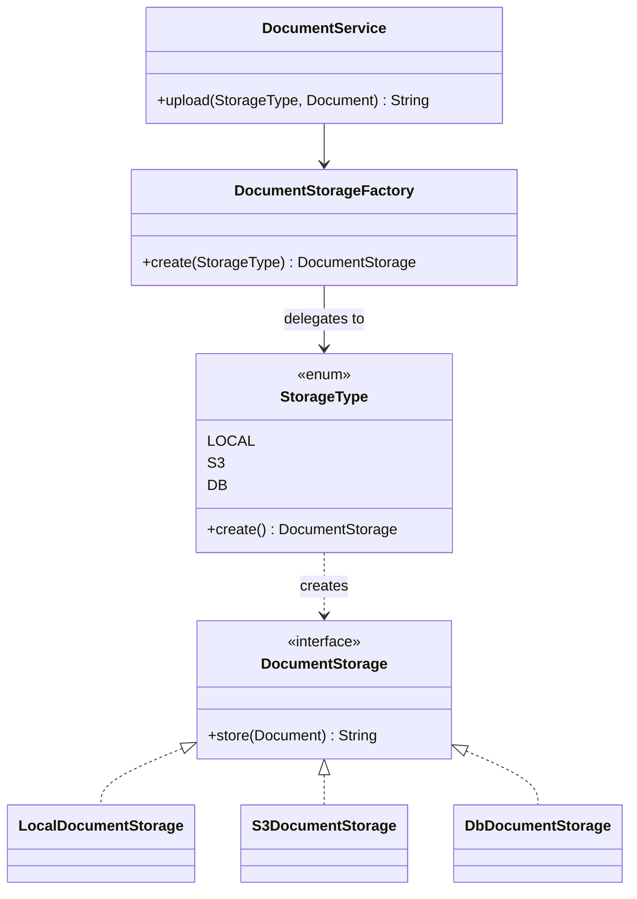

# Simple Factory

`com.prep.pattern_vault.creational.factory`

> **Naming note:** what's implemented here is the informal **Simple Factory**
> idiom, not either of the two GoF creational patterns that get called
> "Factory": **Factory Method** (a `Creator` base class declares a factory
> method that subclasses override to decide which `Product` to build) or
> **Abstract Factory** (a factory interface that creates a *family* of
> related products). Simple Factory isn't in the GoF book at all — it's just
> the everyday pattern of centralizing `new X()` calls behind one method — but
> it's common enough, and useful enough, to document properly.

## Intent

Centralize the decision of *which concrete class to instantiate* in one
place, so calling code depends only on an interface (`DocumentStorage`) and
never needs to know about, or import, the concrete implementations
(`LocalDocumentStorage`, `S3DocumentStorage`, `DbDocumentStorage`).

## Structure



## This implementation

The interesting design choice here is *where* the `switch`-like dispatch
lives. Instead of a factory class with an `if`/`switch` over an enum, the
dispatch is pushed onto the enum itself:

```java
public enum StorageType {
    LOCAL { public DocumentStorage create() { return new LocalDocumentStorage(); } },
    S3    { public DocumentStorage create() { return new S3DocumentStorage(); } },
    DB    { public DocumentStorage create() { return new DbDocumentStorage(); } };

    public abstract DocumentStorage create();
}
```

Each enum constant carries its own constant-specific class body implementing
`create()`. `DocumentStorageFactory.create(StorageType)` becomes a one-liner
that just forwards to `type.create()` — there's no `switch` to keep in sync
as new storage types are added; adding a case means adding an enum constant
with its own `create()` body, and the compiler won't let you forget it.

`DocumentService` is the client: it depends only on `DocumentStorageFactory`
and the `DocumentStorage` interface, never on a concrete storage class.

| Role | Class |
|---|---|
| Product interface | `DocumentStorage` |
| Concrete products | `LocalDocumentStorage`, `S3DocumentStorage`, `DbDocumentStorage` |
| Creation dispatch | `StorageType` (enum-with-constant-bodies) |
| Factory | `DocumentStorageFactory` |
| Client | `DocumentService` |

## Usage

```java
DocumentService service = new DocumentService(new DocumentStorageFactory());
String location = service.upload(StorageType.S3, new Document("report.pdf", bytes));
```

## Notes

- This is a legitimate, idiomatic way to write a simple factory in Java —
  the enum-with-abstract-method idiom is the same trick `java.util.Comparator`
  and plenty of standard-library enums use to avoid a `switch`. It's clean
  for what it is.
- It is **not** Factory Method or Abstract Factory. If a future exercise
  wants those specifically: Factory Method would mean pulling `create()` up
  onto a `DocumentServiceCreator` base class that subclasses override (so
  *which* storage a document service uses is decided by subclassing, not by
  an enum parameter); Abstract Factory would mean introducing a *family* of
  related products (e.g. a storage backend *and* a matching metadata index
  or access-control checker) created together behind one factory interface,
  with one concrete factory per family (`LocalStorageFamilyFactory`,
  `S3StorageFamilyFactory`, ...).
