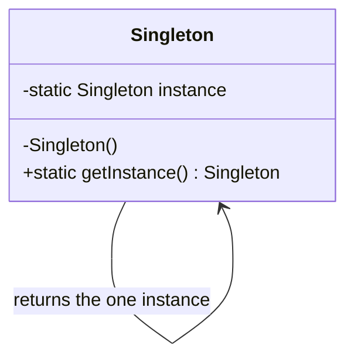

# Singleton

`com.prep.pattern_vault.creational.singleton`

## Intent

Ensure a class has exactly one instance, and provide a single global point of
access to it. Singleton trades away testability and explicit dependency
wiring for the guarantee that everyone in the process sees the same shared
object (a connection pool, a cache, a config snapshot, ...).

## Structure



The private constructor is the whole trick: it's the only thing that stops
`new Singleton()` from being called from outside the class, which is what
would let a second instance leak into existence.

## This implementation

This repo carries **two** singleton implementations side by side, on purpose
— they represent two different ways to get to the same guarantee, and one of
them used to be broken (see [Notes](#notes)).

### `ResourceProvision` — enum singleton

```java
public enum ResourceProvision {
    GET_RESOURCE(10, "resourceParam");
    ...
}
```

An enum with a single constant *is* a singleton: the JVM guarantees that each
enum constant is instantiated exactly once, and that guarantee holds even
under reflection and serialization (both classic ways to accidentally break
a hand-rolled singleton). Access is just `ResourceProvision.GET_RESOURCE`.

### `ConfigDbConnection` — lazily-initialized singleton

```java
public static synchronized ConfigDbConnection getInstance(){
    if (configDbConnection == null) configDbConnection = new ConfigDbConnection();
    return configDbConnection;
}
```

This variant defers construction until the first call to `getInstance()`,
guarded by a `synchronized` method (so two threads racing to create the
first instance can't both succeed) plus a `volatile` backing field (so a
thread that observes a non-null reference also observes a fully-constructed
object, not a half-initialized one due to instruction reordering).

## Usage

```java
ConfigDbConnection connection = ConfigDbConnection.getInstance();
ConfigDbConnection sameConnection = ConfigDbConnection.getInstance();
assert connection == sameConnection; // always true

var resource = ResourceProvision.GET_RESOURCE;
```

## Notes

- **`ConfigDbConnection` used to be broken.** The original `getInstance()`
  read `if (configDbConnection == null) return new ConfigDbConnection();` —
  it constructed a new instance on every call while the field was null, but
  never assigned it back to the static field, so the field stayed `null`
  forever and *every* caller got a distinct object. It was a singleton in
  name only. The fix was the one-line assignment shown above.
- Locking the whole `getInstance()` method (as opposed to double-checked
  locking inside an `if` block) means every call after the first still pays
  a `synchronized` entry/exit cost, even though the object is already built.
  For a rarely-called factory method like this one that's a non-issue; for a
  hot path you'd reach for double-checked locking or, better, the enum form.
- The enum form has no lazy-initialization story — the instance is created
  when the enum class is loaded, not on first use. That's fine for a small
  fixed-size resource descriptor like `ResourceProvision`; it would be the
  wrong choice for a singleton whose construction is itself expensive and
  not always needed.
- Prefer the enum form for new code. It's shorter, it's inherently
  thread-safe with no explicit locking, and it doesn't need a `volatile`
  field or a `synchronized` method to be correct.
