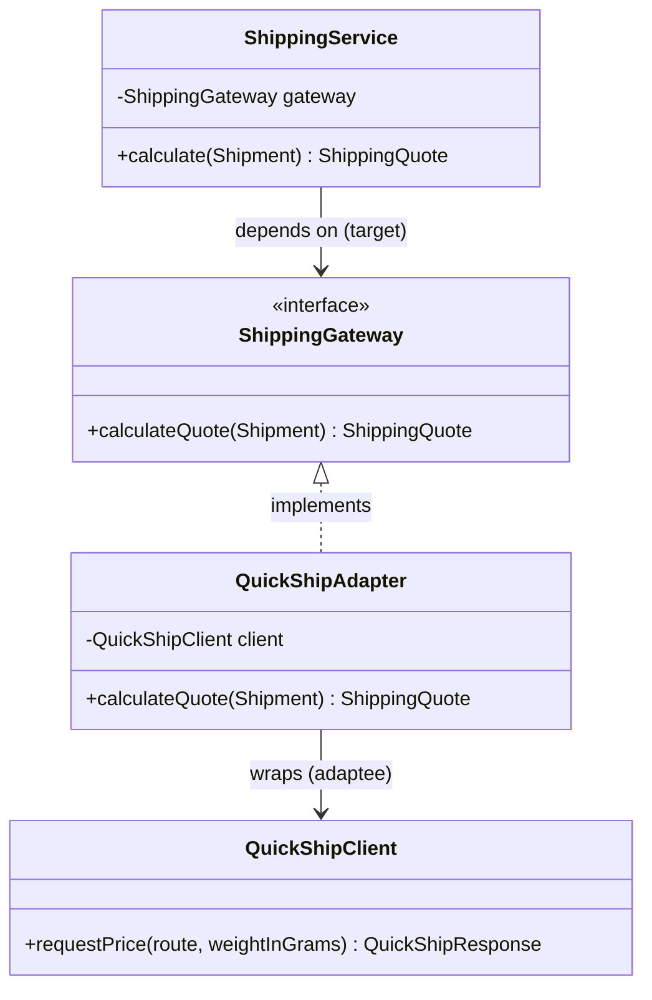

# Adapter

`com.prep.pattern_vault.structural.adapter`

## Intent

Convert the interface a class exposes into the interface a client expects,
letting classes work together that couldn't otherwise because of an
interface mismatch — typically because one side is a third-party client you
don't control.

## Structure



## This implementation

This is an **object adapter** (composition, not inheritance): `QuickShipAdapter`
implements the target interface `ShippingGateway` and holds a reference to
the adaptee, `QuickShipClient`, translating between the two shapes.

| Role | Class |
|---|---|
| Target interface (what the client wants) | `ShippingGateway` |
| Client | `ShippingService` |
| Adaptee (the incompatible interface) | `QuickShipClient` |
| Adapter | `QuickShipAdapter` |

The translation work the adapter does is exactly what makes this pattern
worth its own name — it isn't just forwarding a call, it's reconciling real
mismatches between the two interfaces:

```java
public ShippingQuote calculateQuote(Shipment shipment) {
    String route = String.format("From %s to %s", shipment.originCountry(), shipment.destinationCountry());
    int weightInGrams = shipment.weightInKilograms().multiply(BigDecimal.valueOf(1000)).intValue();
    QuickShipResponse response = quickShipClient.requestPrice(route, weightInGrams);
    return new ShippingQuote(BigDecimal.valueOf(response.priceInCents(), 2), response.currencyCode(), response.deliveryDays());
}
```

Two mismatches are being bridged here:

- **Units.** `Shipment` carries weight in kilograms (a `BigDecimal`);
  `QuickShipClient.requestPrice` wants grams (an `int`). The adapter
  converts (`kg * 1000`) before crossing the boundary.
- **Money representation.** `QuickShipResponse` reports price as an integer
  number of cents (`long priceInCents`); `ShippingQuote` wants a decimal
  amount. `BigDecimal.valueOf(unscaledValue, scale)` — here
  `BigDecimal.valueOf(priceInCents, 2)` — converts an integer-cents value
  into an exact decimal (`1299` → `12.99`) without going through floating
  point or lossy integer division.

## Usage

```java
ShippingGateway gateway = new QuickShipAdapter(new QuickShipClient());
ShippingService service = new ShippingService(gateway);
ShippingQuote quote = service.calculate(new Shipment("US", "DE", BigDecimal.valueOf(2.5)));
```

## Notes

- Both bugs above (missing unit conversion, and `priceInCents / 100` losing
  the fractional cents to integer division) used to be present in this
  adapter — they're exactly the class of bug this pattern is supposed to
  centralize and get right *once*, rather than every call site
  re-implementing the conversion (and re-introducing the bug) independently.
- `ShippingService` never imports `QuickShipClient` or `QuickShipResponse` —
  it only knows about `ShippingGateway`, `Shipment`, and `ShippingQuote`.
  That's the actual payoff of the pattern: swapping `QuickShipClient` for a
  different carrier's SDK means writing one new adapter class, with zero
  changes to `ShippingService`.
