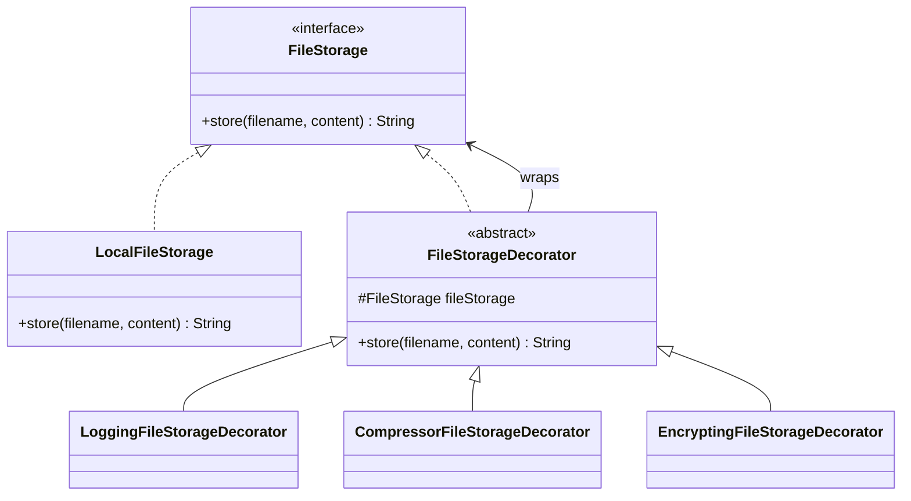

# Decorator

`com.prep.pattern_vault.structural.decorator`

## Intent

Attach additional responsibilities to an object dynamically, by wrapping it
in another object that implements the same interface and delegates to it —
an alternative to subclassing when you need to mix and match behavior at
runtime (e.g. "compressed *and* encrypted *and* logged" storage, in any
combination, without one subclass per combination).

## Structure



## This implementation

| Role | Class |
|---|---|
| Component interface | `FileStorage` |
| Concrete component | `LocalFileStorage` |
| Base decorator | `FileStorageDecorator` (holds the wrapped `FileStorage`) |
| Concrete decorators | `LoggingFileStorageDecorator`, `CompressorFileStorageDecorator`, `EncryptingFileStorageDecorator` |

Each concrete decorator does its own work, then delegates to the wrapped
`fileStorage.store(...)` and returns *that* call's result — this is the part
that has to be right for decorators to compose: if a decorator swallows the
return value or the content it was handed, wrapping it in another decorator
silently loses information.

```java
// CompressorFileStorageDecorator
public String store(String filename, byte[] content) {
    byte[] compressed = compress(content);
    return fileStorage.store(filename, compressed);
}
```

`compress` and `encrypt` are real (if intentionally simple) transformations
— `Deflater`-based compression and a toy XOR cipher respectively — so
stacking decorators actually changes what ends up in `content` at the
bottom of the chain, not just what gets printed to the console.

## Usage

```java
FileStorage storage = new LoggingFileStorageDecorator(
        new EncryptingFileStorageDecorator(
                new CompressorFileStorageDecorator(
                        new LocalFileStorage())));

storage.store("report.csv", data);
// -> compress(data) -> encrypt(...) -> logs around the local store, which persists the fully transformed bytes
```

Order matters: compressing already-encrypted bytes finds a lot less
redundancy to squeeze out, so compress-then-encrypt (as above) is the
sensible order, not the reverse.

## Notes

- Exceptions from the wrapped call are re-thrown with the original
  exception attached as the *cause* (`throw new RuntimeException(msg, exception)`),
  not swallowed — so a stack trace from deep in the decorator stack is still
  visible to whoever catches the outer exception, instead of being replaced
  by a message-only exception with no history.
- The XOR "encryption" is explicitly a placeholder for illustrating the
  pattern's mechanics (a real transformation each layer applies), not a
  usable cipher — a production `EncryptingFileStorageDecorator` would use an
  actual algorithm (e.g. AES via `javax.crypto`) with proper key management.
