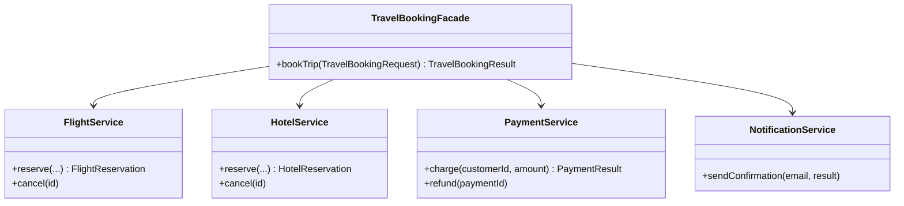

# Facade

`com.prep.pattern_vault.structural.facade`

## Intent

Provide a single, simplified entry point over a set of subsystems that would
otherwise require the client to understand and orchestrate each of them
individually — without hiding the subsystems entirely (a caller who needs
finer control can still reach past the facade and use a subsystem directly).

## Structure



## This implementation

`TravelBookingFacade.bookTrip(TravelBookingRequest)` is the one method a
client needs to call to book a trip; internally it orchestrates four
independent subsystems in the right order and handles the one cross-cutting
concern that spans all of them — what to do if payment fails after the
flight and hotel are already reserved:

```java
public TravelBookingResult bookTrip(TravelBookingRequest request){
    FlightReservation flightReservation = flightService.reserve(request.origin(), request.destination(),
            request.departureDate(), request.returnDate());
    HotelReservation hotelReservation = hotelService.reserve(request.destination(),
            request.departureDate(), request.returnDate());
    PaymentResult paymentResult = paymentService.charge(request.customerId(), request.totalPrice());

    if (!paymentResult.result()) {
        flightService.cancel(flightReservation.id());
        hotelService.cancel(hotelReservation.id());
        throw new BookingFailedException("Payment failed for customer " + request.customerId());
    }

    TravelBookingResult result = new TravelBookingResult(UUID.randomUUID().toString(),
            flightReservation.id(), hotelReservation.id(), paymentResult.id());
    notificationService.sendConfirmation(request.email(), result);
    return result;
}
```

| Role | Class |
|---|---|
| Facade | `TravelBookingFacade` |
| Subsystems | `FlightService`, `HotelService`, `PaymentService`, `NotificationService` |
| Request/response shapes | `TravelBookingRequest`, `TravelBookingResult`, and the per-subsystem DTOs (`FlightReservation`, `HotelReservation`, `PaymentResult`) |

## Usage

```java
TravelBookingFacade facade = new TravelBookingFacade();
TravelBookingRequest request = new TravelBookingRequest(
        "cust-1", "cust@example.com", "US", "UK",
        LocalDate.now(), LocalDate.now().plusDays(5), BigDecimal.valueOf(3000));

TravelBookingResult result = facade.bookTrip(request);
```

## Notes

- The facade doesn't try to be a full saga/orchestrator — the compensation
  logic on payment failure (`cancel` the flight and hotel) is best-effort:
  if `cancel` itself fails, that failure isn't retried or reconciled. That's
  a reasonable scope for a facade demonstrating the pattern; a production
  booking flow spanning real payment providers would want a proper saga with
  persisted state and retries, not synchronous best-effort rollback.
- Each subsystem (`FlightService`, `HotelService`, ...) can still be used on
  its own — the facade doesn't seal them off, it just gives the common case
  (book everything, in the right order, handling the failure path) a single
  call.
