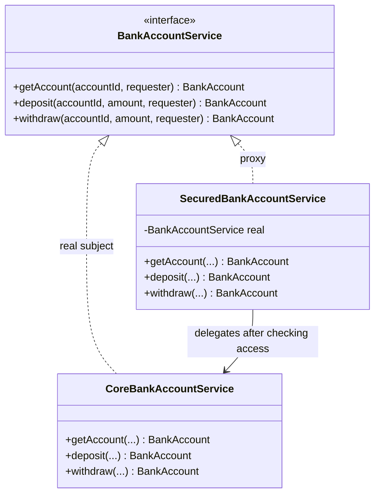

# Proxy

`com.prep.pattern_vault.structural.proxy`

## Intent

Provide a stand-in for another object that controls access to it. The proxy
implements the same interface as the real subject, so callers can't tell
the difference, but it gets to intercept every call — to add access
control (a **protection proxy**, the variant here), lazy loading (a
**virtual proxy**), caching, logging, or remote-call marshalling
(a **remote proxy**), before deciding whether/how to forward to the real
object.

## Structure



## This implementation

`SecuredBankAccountService` is the proxy: it implements `BankAccountService`
just like the real subject, `CoreBankAccountService`, and every method
performs an access check before delegating:

```java
@Override
public BankAccount getAccount(String accountId, User requester) {
    BankAccount account = bankAccountRepository.findById(accountId);
    checkAccess(account, requester);
    return bankAccountService.getAccount(accountId, requester);
}

private void checkAccess(BankAccount account, User requester) {
    if (requester.role().equals(Role.SUPPORT)) throw new AccessDeniedException(requester.id());
    if (requester.role().equals(Role.CUSTOMER) && !requester.id().equals(account.ownerId())) {
        throw new AccessDeniedException(requester.id());
    }
}
```

The access policy, by `Role`:

| Role | Access |
|---|---|
| `ADMIN` | any account |
| `CUSTOMER` | only an account where `requester.id().equals(account.ownerId())` |
| `SUPPORT` | none — always denied |

| Role in pattern | Class |
|---|---|
| Subject interface | `BankAccountService` |
| Real subject | `CoreBankAccountService` |
| Proxy | `SecuredBankAccountService` |

## Usage

```java
BankAccountRepository repository = new BankAccountRepository();
BankAccountService realService = new CoreBankAccountService(repository);
BankAccountService securedService = new SecuredBankAccountService(repository, realService);

// requester must own the account, or be ADMIN — otherwise AccessDeniedException
securedService.deposit(accountId, BigDecimal.TEN, requester);
```

Client code depends only on `BankAccountService` — swapping in
`SecuredBankAccountService` in front of `CoreBankAccountService` (or removing
it) requires no change at the call site.

## Notes

- Before the ownership check was added, `SecuredBankAccountService` only
  ever denied `Role.SUPPORT` — any `CUSTOMER` could read, deposit to, or
  withdraw from *any other customer's* account, because `account.ownerId()`
  was fetched and printed but never compared against `requester.id()`. That
  defeats the point of a protection proxy: the check has to actually check
  something specific to the request, not just the requester's role in the
  abstract.
- `CoreBankAccountService.withdraw` had a boundary bug unrelated to the
  proxy itself: `amount.compareTo(balance) > -1` rejects withdrawing the
  *exact* balance (since `compareTo` returns `0` for equal amounts, and `0
  > -1`); it should only reject withdrawing *more* than the balance
  (`> 0`).
